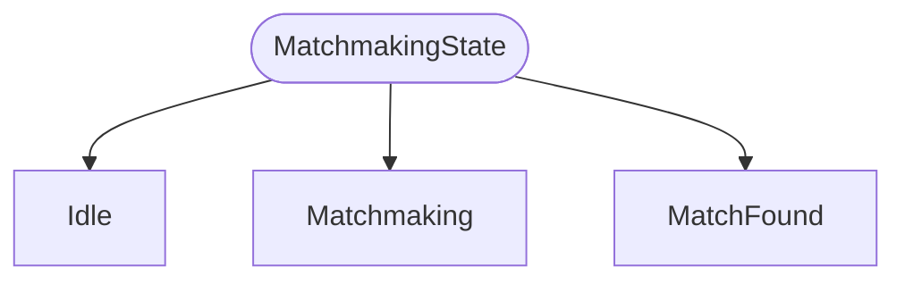

# MatchmakingState

`enum` - wire `uint8`

```mermaid
flowchart TB
  ROOT(["MatchmakingState"])
  ROOT --> Idle["Idle"]
  ROOT --> Matchmaking["Matchmaking"]
  ROOT --> MatchFound["MatchFound"]
```

