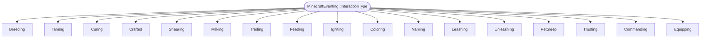

# MinecraftEventing::InteractionType

`enum` - wire `uint8`

```mermaid
flowchart TB
  ROOT(["MinecraftEventing::InteractionType"])
  ROOT --> Breeding["Breeding"]
  ROOT --> Taming["Taming"]
  ROOT --> Curing["Curing"]
  ROOT --> Crafted["Crafted"]
  ROOT --> Shearing["Shearing"]
  ROOT --> Milking["Milking"]
  ROOT --> Trading["Trading"]
  ROOT --> Feeding["Feeding"]
  ROOT --> Igniting["Igniting"]
  ROOT --> Coloring["Coloring"]
  ROOT --> Naming["Naming"]
  ROOT --> Leashing["Leashing"]
  ROOT --> Unleashing["Unleashing"]
  ROOT --> PetSleep["PetSleep"]
  ROOT --> Trusting["Trusting"]
  ROOT --> Commanding["Commanding"]
  ROOT --> Equipping["Equipping"]
```

