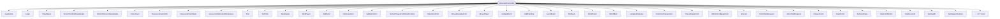

# MinecraftPacketIds

`enum` - wire `int32`

```mermaid
flowchart TB
  ROOT(["MinecraftPacketIds"])
  ROOT --> KeepAlive["KeepAlive"]
  ROOT --> Login["Login"]
  ROOT --> PlayStatus["PlayStatus"]
  ROOT --> ServerToClientHandshake["ServerToClientHandshake"]
  ROOT --> ClientToServerHandshake["ClientToServerHandshake"]
  ROOT --> Disconnect["Disconnect"]
  ROOT --> ResourcePacksInfo["ResourcePacksInfo"]
  ROOT --> ResourcePackStack["ResourcePackStack"]
  ROOT --> ResourcePackClientResponse["ResourcePackClientResponse"]
  ROOT --> Text["Text"]
  ROOT --> SetTime["SetTime"]
  ROOT --> StartGame["StartGame"]
  ROOT --> AddPlayer["AddPlayer"]
  ROOT --> AddActor["AddActor"]
  ROOT --> RemoveActor["RemoveActor"]
  ROOT --> AddItemActor["AddItemActor"]
  ROOT --> ServerPlayerPostMovePosition["ServerPlayerPostMovePosition"]
  ROOT --> TakeItemActor["TakeItemActor"]
  ROOT --> MoveAbsoluteActor["MoveAbsoluteActor"]
  ROOT --> MovePlayer["MovePlayer"]
  ROOT --> UpdateBlock["UpdateBlock"]
  ROOT --> AddPainting["AddPainting"]
  ROOT --> LevelEvent["LevelEvent"]
  ROOT --> TileEvent["TileEvent"]
  ROOT --> ActorEvent["ActorEvent"]
  ROOT --> MobEffect["MobEffect"]
  ROOT --> UpdateAttributes["UpdateAttributes"]
  ROOT --> InventoryTransaction["InventoryTransaction"]
  ROOT --> PlayerEquipment["PlayerEquipment"]
  ROOT --> MobArmorEquipment["MobArmorEquipment"]
  ROOT --> Interact["Interact"]
  ROOT --> BlockPickRequest["BlockPickRequest"]
  ROOT --> ActorPickRequest["ActorPickRequest"]
  ROOT --> PlayerAction["PlayerAction"]
  ROOT --> HurtArmor["HurtArmor"]
  ROOT --> SetActorData["SetActorData"]
  ROOT --> SetActorMotion["SetActorMotion"]
  ROOT --> SetActorLink["SetActorLink"]
  ROOT --> SetHealth["SetHealth"]
  ROOT --> SetSpawnPosition["SetSpawnPosition"]
  ROOT --> more["... 177 more"]
```

