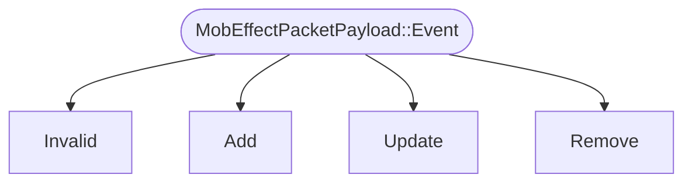

# MobEffectPacketPayload::Event

`enum` - wire `uint8`

```mermaid
flowchart TB
  ROOT(["MobEffectPacketPayload::Event"])
  ROOT --> Invalid["Invalid"]
  ROOT --> Add["Add"]
  ROOT --> Update["Update"]
  ROOT --> Remove["Remove"]
```

