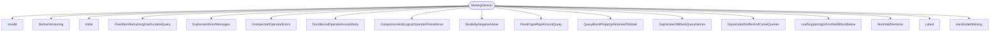

# MolangVersion

`enum` - wire `int16`

```mermaid
flowchart TB
  ROOT(["MolangVersion"])
  ROOT --> Invalid["Invalid"]
  ROOT --> BeforeVersioning["BeforeVersioning"]
  ROOT --> Initial["Initial"]
  ROOT --> FixedItemRemainingUseDurationQuery["FixedItemRemainingUseDurationQuery"]
  ROOT --> ExpressionErrorMessages["ExpressionErrorMessages"]
  ROOT --> UnexpectedOperatorErrors["UnexpectedOperatorErrors"]
  ROOT --> ConditionalOperatorAssociativity["ConditionalOperatorAssociativity"]
  ROOT --> ComparisonAndLogicalOperatorPrecedence["ComparisonAndLogicalOperatorPrecedence"]
  ROOT --> DivideByNegativeValue["DivideByNegativeValue"]
  ROOT --> FixedCapeFlapAmountQuery["FixedCapeFlapAmountQuery"]
  ROOT --> QueryBlockPropertyRenamedToState["QueryBlockPropertyRenamedToState"]
  ROOT --> DeprecateOldBlockQueryNames["DeprecateOldBlockQueryNames"]
  ROOT --> DeprecatedSnifferAndCamelQueries["DeprecatedSnifferAndCamelQueries"]
  ROOT --> LeafSupportingInFirstSolidBlockBelow["LeafSupportingInFirstSolidBlockBelow"]
  ROOT --> NumValidVersions["NumValidVersions"]
  ROOT --> Latest["Latest"]
  ROOT --> HardcodedMolang["HardcodedMolang"]
```

