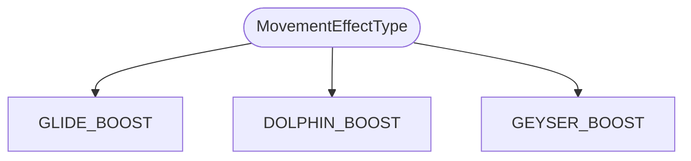

# MovementEffectType

`enum` - wire `int32`

```mermaid
flowchart TB
  ROOT(["MovementEffectType"])
  ROOT --> GLIDE_BOOST["GLIDE_BOOST"]
  ROOT --> DOLPHIN_BOOST["DOLPHIN_BOOST"]
  ROOT --> GEYSER_BOOST["GEYSER_BOOST"]
```

