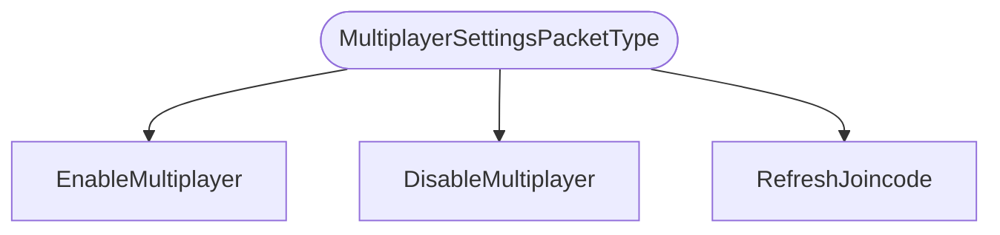

# MultiplayerSettingsPacketType

`enum` - wire `int32`

```mermaid
flowchart TB
  ROOT(["MultiplayerSettingsPacketType"])
  ROOT --> EnableMultiplayer["EnableMultiplayer"]
  ROOT --> DisableMultiplayer["DisableMultiplayer"]
  ROOT --> RefreshJoincode["RefreshJoincode"]
```

