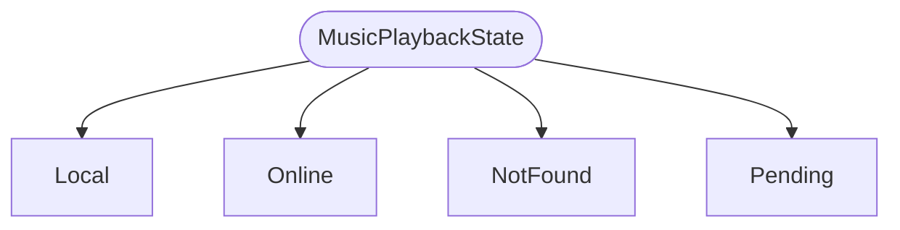

# MusicPlaybackState

`enum` - wire `uint8`

```mermaid
flowchart TB
  ROOT(["MusicPlaybackState"])
  ROOT --> Local["Local"]
  ROOT --> Online["Online"]
  ROOT --> NotFound["NotFound"]
  ROOT --> Pending["Pending"]
```

