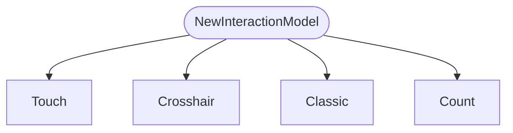

# NewInteractionModel

`enum` - wire `int32`

```mermaid
flowchart TB
  ROOT(["NewInteractionModel"])
  ROOT --> Touch["Touch"]
  ROOT --> Crosshair["Crosshair"]
  ROOT --> Classic["Classic"]
  ROOT --> Count["Count"]
```

