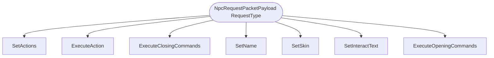

# NpcRequestPacketPayload RequestType

`enum` - wire `uint8`

```mermaid
flowchart TB
  ROOT(["NpcRequestPacketPayload RequestType"])
  ROOT --> SetActions["SetActions"]
  ROOT --> ExecuteAction["ExecuteAction"]
  ROOT --> ExecuteClosingCommands["ExecuteClosingCommands"]
  ROOT --> SetName["SetName"]
  ROOT --> SetSkin["SetSkin"]
  ROOT --> SetInteractText["SetInteractText"]
  ROOT --> ExecuteOpeningCommands["ExecuteOpeningCommands"]
```

