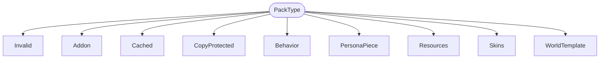

# PackType

`enum` - wire `object`

```mermaid
flowchart TB
  ROOT(["PackType"])
  ROOT --> Invalid["Invalid"]
  ROOT --> Addon["Addon"]
  ROOT --> Cached["Cached"]
  ROOT --> CopyProtected["CopyProtected"]
  ROOT --> Behavior["Behavior"]
  ROOT --> PersonaPiece["PersonaPiece"]
  ROOT --> Resources["Resources"]
  ROOT --> Skins["Skins"]
  ROOT --> WorldTemplate["WorldTemplate"]
```

