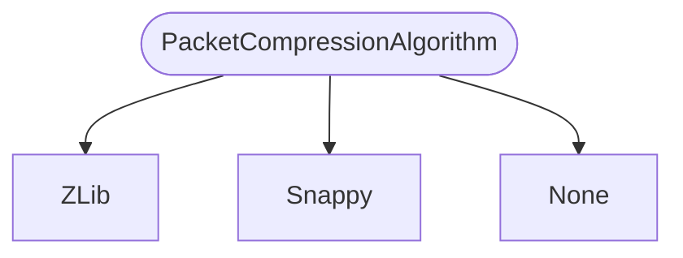

# PacketCompressionAlgorithm

`enum` - wire `uint16`

```mermaid
flowchart TB
  ROOT(["PacketCompressionAlgorithm"])
  ROOT --> ZLib["ZLib"]
  ROOT --> Snappy["Snappy"]
  ROOT --> None["None"]
```

