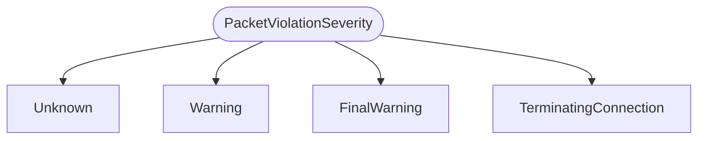

# PacketViolationSeverity

`enum` - wire `int32`

```mermaid
flowchart TB
  ROOT(["PacketViolationSeverity"])
  ROOT --> Unknown["Unknown"]
  ROOT --> Warning["Warning"]
  ROOT --> FinalWarning["FinalWarning"]
  ROOT --> TerminatingConnection["TerminatingConnection"]
```

