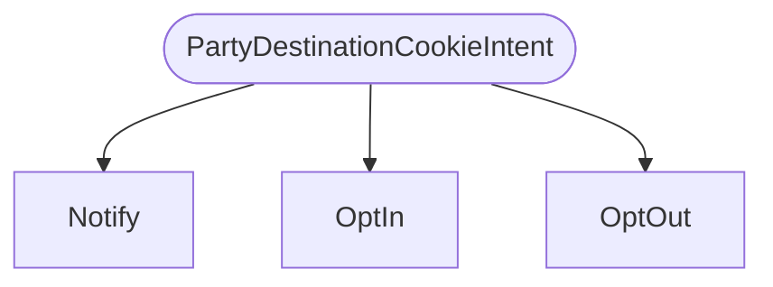

# PartyDestinationCookieIntent

`enum` - wire `int8`

```mermaid
flowchart TB
  ROOT(["PartyDestinationCookieIntent"])
  ROOT --> Notify["Notify"]
  ROOT --> OptIn["OptIn"]
  ROOT --> OptOut["OptOut"]
```

