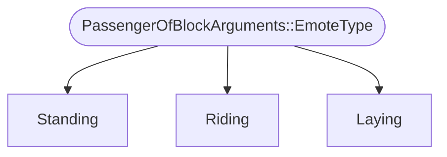

# PassengerOfBlockArguments::EmoteType

`enum` - wire `uint8`

```mermaid
flowchart TB
  ROOT(["PassengerOfBlockArguments::EmoteType"])
  ROOT --> Standing["Standing"]
  ROOT --> Riding["Riding"]
  ROOT --> Laying["Laying"]
```

