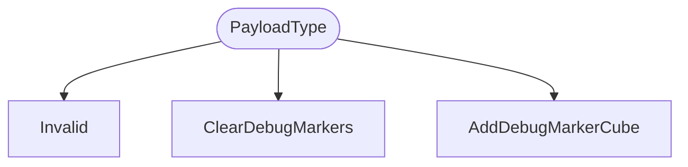

# PayloadType

`enum` - wire `uint8`

```mermaid
flowchart TB
  ROOT(["PayloadType"])
  ROOT --> Invalid["Invalid"]
  ROOT --> ClearDebugMarkers["ClearDebugMarkers"]
  ROOT --> AddDebugMarkerCube["AddDebugMarkerCube"]
```

