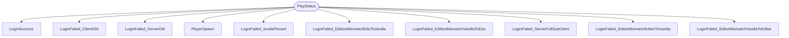

# PlayStatus

`enum` - wire `int32`

```mermaid
flowchart TB
  ROOT(["PlayStatus"])
  ROOT --> LoginSuccess["LoginSuccess"]
  ROOT --> LoginFailed_ClientOld["LoginFailed_ClientOld"]
  ROOT --> LoginFailed_ServerOld["LoginFailed_ServerOld"]
  ROOT --> PlayerSpawn["PlayerSpawn"]
  ROOT --> LoginFailed_InvalidTenant["LoginFailed_InvalidTenant"]
  ROOT --> LoginFailed_EditionMismatchEduToVanilla["LoginFailed_EditionMismatchEduToVanilla"]
  ROOT --> LoginFailed_EditionMismatchVanillaToEdu["LoginFailed_EditionMismatchVanillaToEdu"]
  ROOT --> LoginFailed_ServerFullSubClient["LoginFailed_ServerFullSubClient"]
  ROOT --> LoginFailed_EditorMismatchEditorToVanilla["LoginFailed_EditorMismatchEditorToVanilla"]
  ROOT --> LoginFailed_EditorMismatchVanillaToEditor["LoginFailed_EditorMismatchVanillaToEditor"]
```

