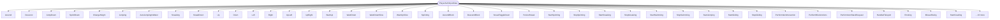

# PlayerAuthInputData

`enum` - wire `int32`

```mermaid
flowchart TB
  ROOT(["PlayerAuthInputData"])
  ROOT --> Ascend["Ascend"]
  ROOT --> Descend["Descend"]
  ROOT --> JumpDown["JumpDown"]
  ROOT --> SprintDown["SprintDown"]
  ROOT --> ChangeHeight["ChangeHeight"]
  ROOT --> Jumping["Jumping"]
  ROOT --> AutoJumpingInWater["AutoJumpingInWater"]
  ROOT --> Sneaking["Sneaking"]
  ROOT --> SneakDown["SneakDown"]
  ROOT --> Up["Up"]
  ROOT --> Down["Down"]
  ROOT --> Left["Left"]
  ROOT --> Right["Right"]
  ROOT --> UpLeft["UpLeft"]
  ROOT --> UpRight["UpRight"]
  ROOT --> WantUp["WantUp"]
  ROOT --> WantDown["WantDown"]
  ROOT --> WantDownSlow["WantDownSlow"]
  ROOT --> WantUpSlow["WantUpSlow"]
  ROOT --> Sprinting["Sprinting"]
  ROOT --> AscendBlock["AscendBlock"]
  ROOT --> DescendBlock["DescendBlock"]
  ROOT --> SneakToggleDown["SneakToggleDown"]
  ROOT --> PersistSneak["PersistSneak"]
  ROOT --> StartSprinting["StartSprinting"]
  ROOT --> StopSprinting["StopSprinting"]
  ROOT --> StartSneaking["StartSneaking"]
  ROOT --> StopSneaking["StopSneaking"]
  ROOT --> StartSwimming["StartSwimming"]
  ROOT --> StopSwimming["StopSwimming"]
  ROOT --> StartJumping["StartJumping"]
  ROOT --> StartGliding["StartGliding"]
  ROOT --> StopGliding["StopGliding"]
  ROOT --> PerformItemInteraction["PerformItemInteraction"]
  ROOT --> PerformBlockActions["PerformBlockActions"]
  ROOT --> PerformItemStackRequest["PerformItemStackRequest"]
  ROOT --> HandledTeleport["HandledTeleport"]
  ROOT --> Emoting["Emoting"]
  ROOT --> MissedSwing["MissedSwing"]
  ROOT --> StartCrawling["StartCrawling"]
  ROOT --> more["... 23 more"]
```

