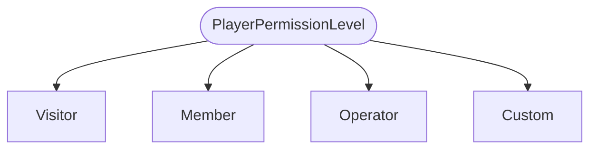

# PlayerPermissionLevel

`enum` - wire `int8`

```mermaid
flowchart TB
  ROOT(["PlayerPermissionLevel"])
  ROOT --> Visitor["Visitor"]
  ROOT --> Member["Member"]
  ROOT --> Operator["Operator"]
  ROOT --> Custom["Custom"]
```

