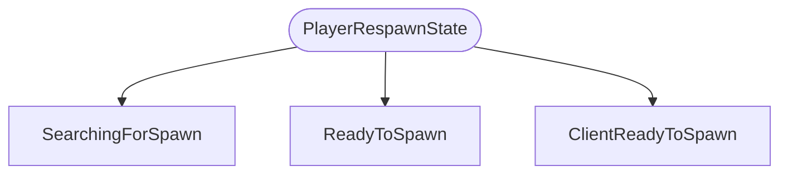

# PlayerRespawnState

`enum` - wire `uint8`

```mermaid
flowchart TB
  ROOT(["PlayerRespawnState"])
  ROOT --> SearchingForSpawn["SearchingForSpawn"]
  ROOT --> ReadyToSpawn["ReadyToSpawn"]
  ROOT --> ClientReadyToSpawn["ClientReadyToSpawn"]
```

