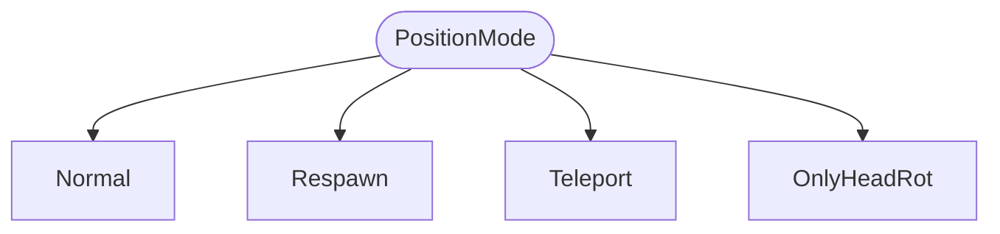

# PositionMode

`enum` - wire `uint8`

```mermaid
flowchart TB
  ROOT(["PositionMode"])
  ROOT --> Normal["Normal"]
  ROOT --> Respawn["Respawn"]
  ROOT --> Teleport["Teleport"]
  ROOT --> OnlyHeadRot["OnlyHeadRot"]
```

