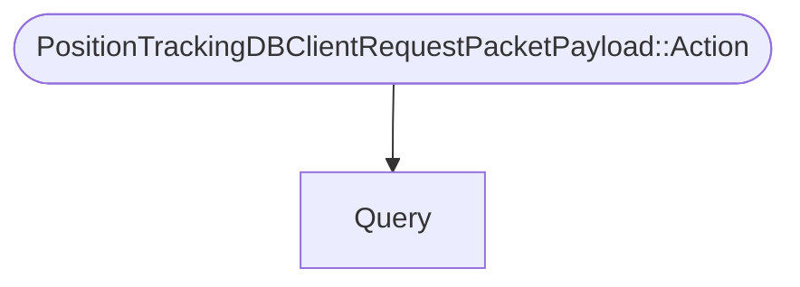

# PositionTrackingDBClientRequestPacketPayload::Action

`enum` - wire `uint8`

```mermaid
flowchart TB
  ROOT(["PositionTrackingDBClientRequestPacketPayload::Action"])
  ROOT --> Query["Query"]
```

