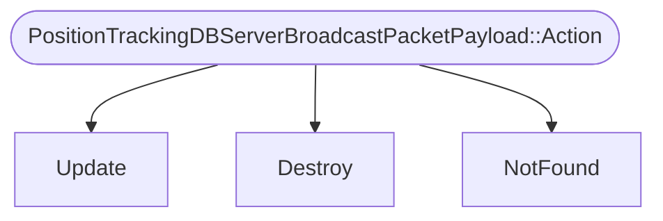

# PositionTrackingDBServerBroadcastPacketPayload::Action

`enum` - wire `uint8`

```mermaid
flowchart TB
  ROOT(["PositionTrackingDBServerBroadcastPacketPayload::Action"])
  ROOT --> Update["Update"]
  ROOT --> Destroy["Destroy"]
  ROOT --> NotFound["NotFound"]
```

