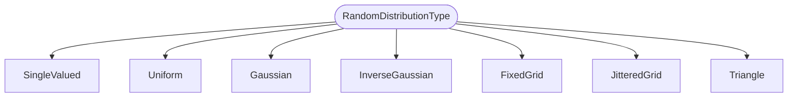

# RandomDistributionType

`enum` - wire `int32`

```mermaid
flowchart TB
  ROOT(["RandomDistributionType"])
  ROOT --> SingleValued["SingleValued"]
  ROOT --> Uniform["Uniform"]
  ROOT --> Gaussian["Gaussian"]
  ROOT --> InverseGaussian["InverseGaussian"]
  ROOT --> FixedGrid["FixedGrid"]
  ROOT --> JitteredGrid["JitteredGrid"]
  ROOT --> Triangle["Triangle"]
```

