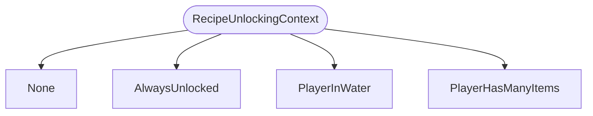

# RecipeUnlockingContext

`enum` - wire `int32`

```mermaid
flowchart TB
  ROOT(["RecipeUnlockingContext"])
  ROOT --> None["None"]
  ROOT --> AlwaysUnlocked["AlwaysUnlocked"]
  ROOT --> PlayerInWater["PlayerInWater"]
  ROOT --> PlayerHasManyItems["PlayerHasManyItems"]
```

