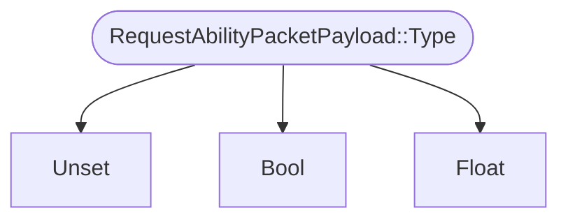

# RequestAbilityPacketPayload::Type

`enum` - wire `uint8`

```mermaid
flowchart TB
  ROOT(["RequestAbilityPacketPayload::Type"])
  ROOT --> Unset["Unset"]
  ROOT --> Bool["Bool"]
  ROOT --> Float["Float"]
```

