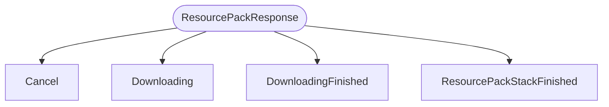

# ResourcePackResponse

`enum` - wire `int8`

```mermaid
flowchart TB
  ROOT(["ResourcePackResponse"])
  ROOT --> Cancel["Cancel"]
  ROOT --> Downloading["Downloading"]
  ROOT --> DownloadingFinished["DownloadingFinished"]
  ROOT --> ResourcePackStackFinished["ResourcePackStackFinished"]
```

