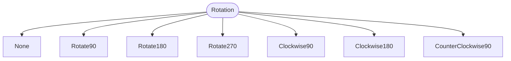

# Rotation

`enum` - wire `uint8`

```mermaid
flowchart TB
  ROOT(["Rotation"])
  ROOT --> None["None"]
  ROOT --> Rotate90["Rotate90"]
  ROOT --> Rotate180["Rotate180"]
  ROOT --> Rotate270["Rotate270"]
  ROOT --> Clockwise90["Clockwise90"]
  ROOT --> Clockwise180["Clockwise180"]
  ROOT --> CounterClockwise90["CounterClockwise90"]
```

