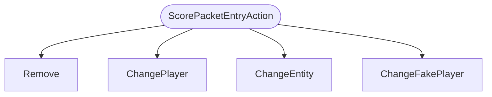

# ScorePacketEntryAction

`enum` - wire `uint8`

```mermaid
flowchart TB
  ROOT(["ScorePacketEntryAction"])
  ROOT --> Remove["Remove"]
  ROOT --> ChangePlayer["ChangePlayer"]
  ROOT --> ChangeEntity["ChangeEntity"]
  ROOT --> ChangeFakePlayer["ChangeFakePlayer"]
```

