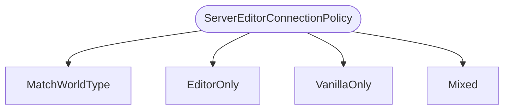

# ServerEditorConnectionPolicy

`enum` - wire `int32`

```mermaid
flowchart TB
  ROOT(["ServerEditorConnectionPolicy"])
  ROOT --> MatchWorldType["MatchWorldType"]
  ROOT --> EditorOnly["EditorOnly"]
  ROOT --> VanillaOnly["VanillaOnly"]
  ROOT --> Mixed["Mixed"]
```

