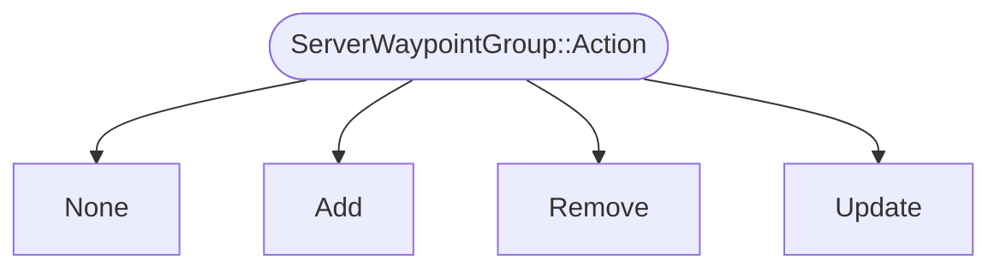

# ServerWaypointGroup::Action

`enum` - wire `uint8`

```mermaid
flowchart TB
  ROOT(["ServerWaypointGroup::Action"])
  ROOT --> None["None"]
  ROOT --> Add["Add"]
  ROOT --> Remove["Remove"]
  ROOT --> Update["Update"]
```

