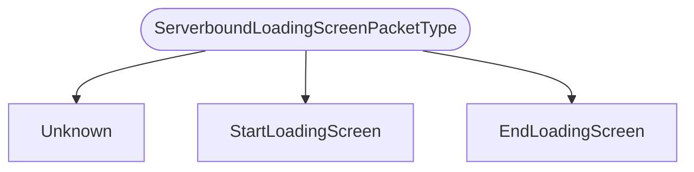

# ServerboundLoadingScreenPacketType

`enum` - wire `int32`

```mermaid
flowchart TB
  ROOT(["ServerboundLoadingScreenPacketType"])
  ROOT --> Unknown["Unknown"]
  ROOT --> StartLoadingScreen["StartLoadingScreen"]
  ROOT --> EndLoadingScreen["EndLoadingScreen"]
```

