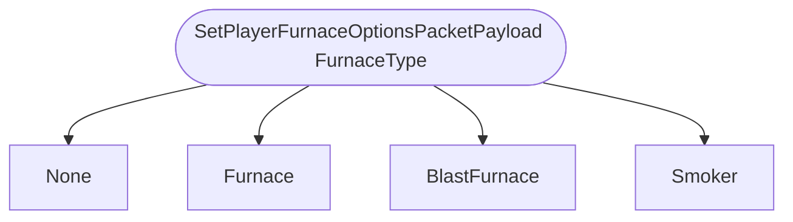

# SetPlayerFurnaceOptionsPacketPayload FurnaceType

`enum` - wire `uint8`

```mermaid
flowchart TB
  ROOT(["SetPlayerFurnaceOptionsPacketPayload FurnaceType"])
  ROOT --> None["None"]
  ROOT --> Furnace["Furnace"]
  ROOT --> BlastFurnace["BlastFurnace"]
  ROOT --> Smoker["Smoker"]
```

