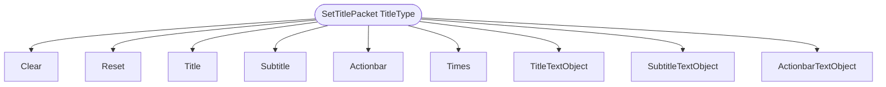

# SetTitlePacket TitleType

`enum` - wire `int32`

```mermaid
flowchart TB
  ROOT(["SetTitlePacket TitleType"])
  ROOT --> Clear["Clear"]
  ROOT --> Reset["Reset"]
  ROOT --> Title["Title"]
  ROOT --> Subtitle["Subtitle"]
  ROOT --> Actionbar["Actionbar"]
  ROOT --> Times["Times"]
  ROOT --> TitleTextObject["TitleTextObject"]
  ROOT --> SubtitleTextObject["SubtitleTextObject"]
  ROOT --> ActionbarTextObject["ActionbarTextObject"]
```

