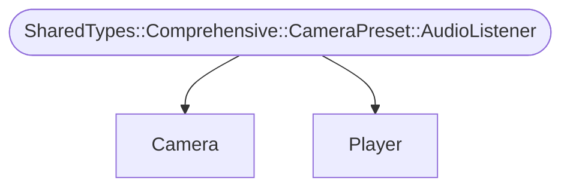

# SharedTypes::Comprehensive::CameraPreset::AudioListener

`enum` - wire `uint8`

```mermaid
flowchart TB
  ROOT(["SharedTypes::Comprehensive::CameraPreset::AudioListener"])
  ROOT --> Camera["Camera"]
  ROOT --> Player["Player"]
```

