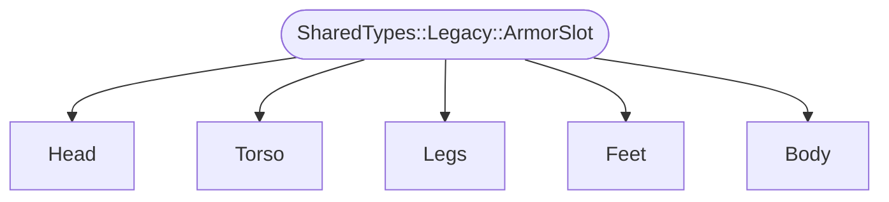

# SharedTypes::Legacy::ArmorSlot

`enum` - wire `int32`

```mermaid
flowchart TB
  ROOT(["SharedTypes::Legacy::ArmorSlot"])
  ROOT --> Head["Head"]
  ROOT --> Torso["Torso"]
  ROOT --> Legs["Legs"]
  ROOT --> Feet["Feet"]
  ROOT --> Body["Body"]
```

