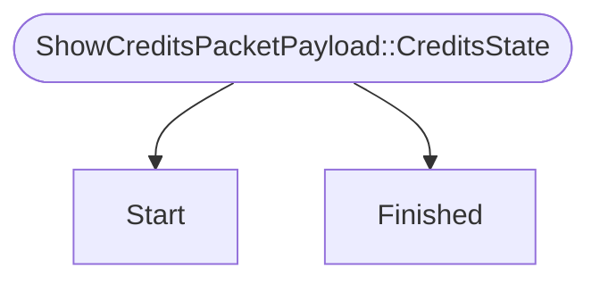

# ShowCreditsPacketPayload::CreditsState

`enum` - wire `int32`

```mermaid
flowchart TB
  ROOT(["ShowCreditsPacketPayload::CreditsState"])
  ROOT --> Start["Start"]
  ROOT --> Finished["Finished"]
```

