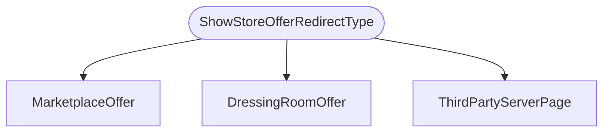

# ShowStoreOfferRedirectType

`enum` - wire `uint8`

```mermaid
flowchart TB
  ROOT(["ShowStoreOfferRedirectType"])
  ROOT --> MarketplaceOffer["MarketplaceOffer"]
  ROOT --> DressingRoomOffer["DressingRoomOffer"]
  ROOT --> ThirdPartyServerPage["ThirdPartyServerPage"]
```

