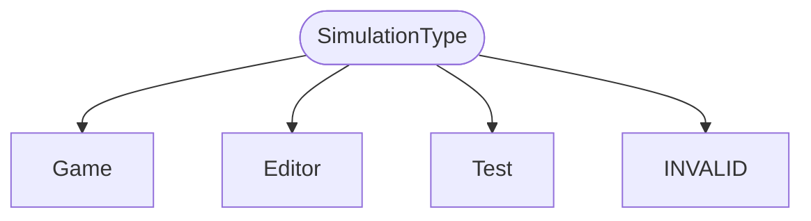

# SimulationType

`enum` - wire `uint8`

```mermaid
flowchart TB
  ROOT(["SimulationType"])
  ROOT --> Game["Game"]
  ROOT --> Editor["Editor"]
  ROOT --> Test["Test"]
  ROOT --> INVALID["INVALID"]
```

