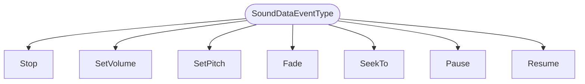

# SoundDataEventType

`enum` - wire `uint8`

```mermaid
flowchart TB
  ROOT(["SoundDataEventType"])
  ROOT --> Stop["Stop"]
  ROOT --> SetVolume["SetVolume"]
  ROOT --> SetPitch["SetPitch"]
  ROOT --> Fade["Fade"]
  ROOT --> SeekTo["SeekTo"]
  ROOT --> Pause["Pause"]
  ROOT --> Resume["Resume"]
```

