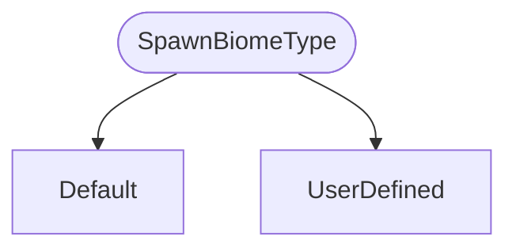

# SpawnBiomeType

`enum` - wire `int16`

- protocol: 2168
- minecraft: 1.26.40

```mermaid
flowchart TB
  ROOT(["SpawnBiomeType"])
  ROOT --> Default["Default"]
  ROOT --> UserDefined["UserDefined"]
```

