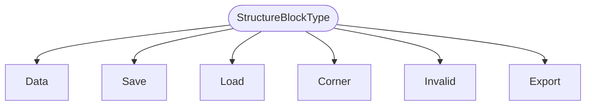

# StructureBlockType

`enum` - wire `int32`

```mermaid
flowchart TB
  ROOT(["StructureBlockType"])
  ROOT --> Data["Data"]
  ROOT --> Save["Save"]
  ROOT --> Load["Load"]
  ROOT --> Corner["Corner"]
  ROOT --> Invalid["Invalid"]
  ROOT --> Export["Export"]
```

