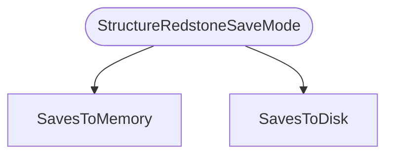

# StructureRedstoneSaveMode

`enum` - wire `uint8`

```mermaid
flowchart TB
  ROOT(["StructureRedstoneSaveMode"])
  ROOT --> SavesToMemory["SavesToMemory"]
  ROOT --> SavesToDisk["SavesToDisk"]
```

