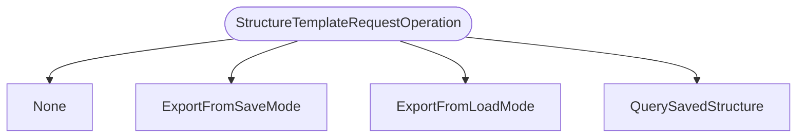

# StructureTemplateRequestOperation

`enum` - wire `uint8`

```mermaid
flowchart TB
  ROOT(["StructureTemplateRequestOperation"])
  ROOT --> None["None"]
  ROOT --> ExportFromSaveMode["ExportFromSaveMode"]
  ROOT --> ExportFromLoadMode["ExportFromLoadMode"]
  ROOT --> QuerySavedStructure["QuerySavedStructure"]
```

