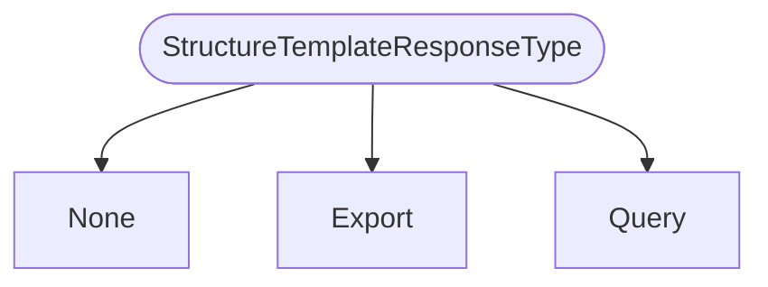

# StructureTemplateResponseType

`enum` - wire `uint8`

```mermaid
flowchart TB
  ROOT(["StructureTemplateResponseType"])
  ROOT --> None["None"]
  ROOT --> Export["Export"]
  ROOT --> Query["Query"]
```

