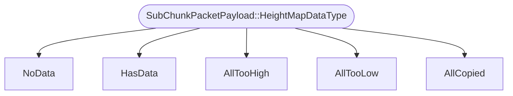

# SubChunkPacketPayload::HeightMapDataType

`enum` - wire `uint8`

```mermaid
flowchart TB
  ROOT(["SubChunkPacketPayload::HeightMapDataType"])
  ROOT --> NoData["NoData"]
  ROOT --> HasData["HasData"]
  ROOT --> AllTooHigh["AllTooHigh"]
  ROOT --> AllTooLow["AllTooLow"]
  ROOT --> AllCopied["AllCopied"]
```

