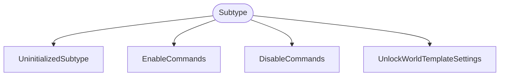

# Subtype

`enum` - wire `uint16`

```mermaid
flowchart TB
  ROOT(["Subtype"])
  ROOT --> UninitializedSubtype["UninitializedSubtype"]
  ROOT --> EnableCommands["EnableCommands"]
  ROOT --> DisableCommands["DisableCommands"]
  ROOT --> UnlockWorldTemplateSettings["UnlockWorldTemplateSettings"]
```

