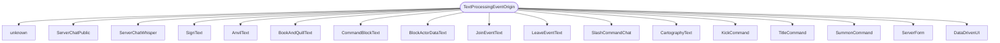

# TextProcessingEventOrigin

`enum` - wire `int32`

```mermaid
flowchart TB
  ROOT(["TextProcessingEventOrigin"])
  ROOT --> unknown["unknown"]
  ROOT --> ServerChatPublic["ServerChatPublic"]
  ROOT --> ServerChatWhisper["ServerChatWhisper"]
  ROOT --> SignText["SignText"]
  ROOT --> AnvilText["AnvilText"]
  ROOT --> BookAndQuillText["BookAndQuillText"]
  ROOT --> CommandBlockText["CommandBlockText"]
  ROOT --> BlockActorDataText["BlockActorDataText"]
  ROOT --> JoinEventText["JoinEventText"]
  ROOT --> LeaveEventText["LeaveEventText"]
  ROOT --> SlashCommandChat["SlashCommandChat"]
  ROOT --> CartographyText["CartographyText"]
  ROOT --> KickCommand["KickCommand"]
  ROOT --> TitleCommand["TitleCommand"]
  ROOT --> SummonCommand["SummonCommand"]
  ROOT --> ServerForm["ServerForm"]
  ROOT --> DataDrivenUI["DataDrivenUI"]
```

