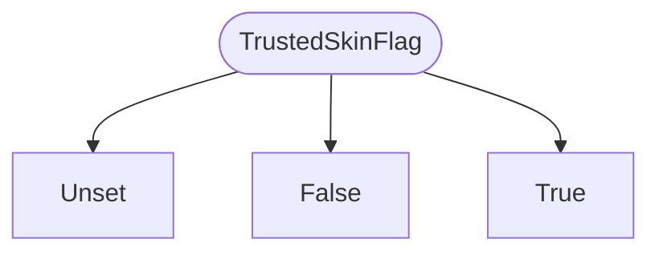

# TrustedSkinFlag

`enum` - wire `object`

- protocol: 2168
- minecraft: 1.26.40

```mermaid
flowchart TB
  ROOT(["TrustedSkinFlag"])
  ROOT --> Unset["Unset"]
  ROOT --> False["False"]
  ROOT --> True["True"]
```

