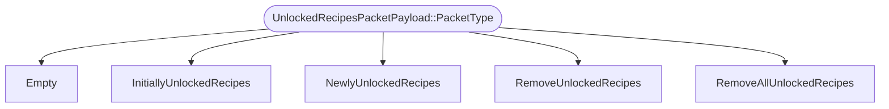

# UnlockedRecipesPacketPayload::PacketType

`enum` - wire `uint32`

```mermaid
flowchart TB
  ROOT(["UnlockedRecipesPacketPayload::PacketType"])
  ROOT --> Empty["Empty"]
  ROOT --> InitiallyUnlockedRecipes["InitiallyUnlockedRecipes"]
  ROOT --> NewlyUnlockedRecipes["NewlyUnlockedRecipes"]
  ROOT --> RemoveUnlockedRecipes["RemoveUnlockedRecipes"]
  ROOT --> RemoveAllUnlockedRecipes["RemoveAllUnlockedRecipes"]
```

